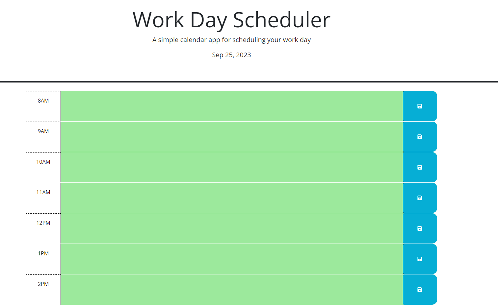

# 05Weekly-Challenge
I Created a daily planner to create a schedule
WHEN I open the planner the current day is displayed at the top of the calendar
WHEN I scroll down I am presented with timeblocks for standard business hours of 8am - 6pm
I can view the timeblocks for that day
Each timeblock is color coded to indicate whether it is in the past, present, or future
I can click into a timeblock and enter an event and save that timeblock
When I save the events persist

## Links
Repo: https://github.com/MzRainy/05Weekly-Challenge.gitLinks to an external site.

Pages: https://mzrainy.github.io/05Weekly-Challenge/Links to an external site.

Portfolio: https://mzrainy.github.io/Portfolio_IQ/

## Screenshot
